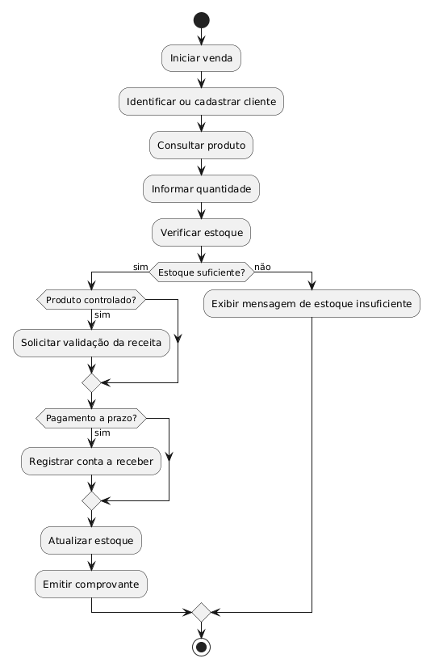
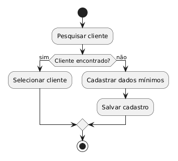
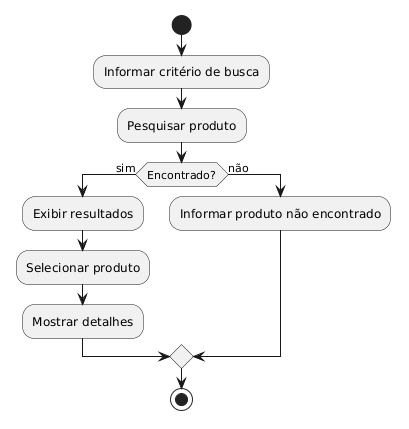
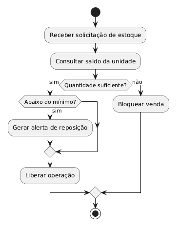
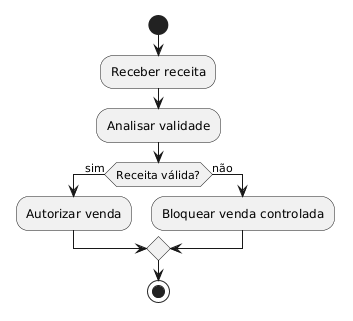
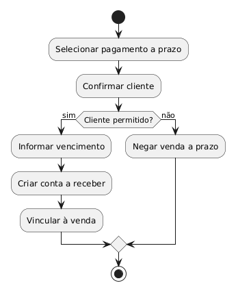
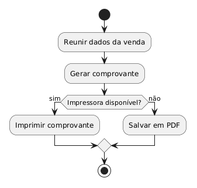
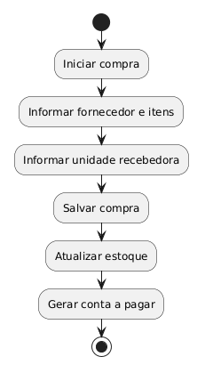
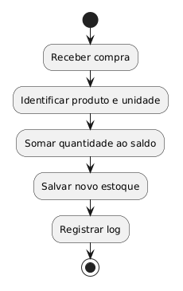
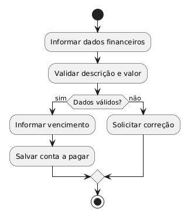

# Avaliação — Engenharia de Software
**Sistema Integrado de Gestão de Farmácia — MVP Definido pelo Estudante**

Aluno: Lucas Vigo Calió  
RA: 24000092  
Data: 26/03/2026  

---

# 1. Definição do MVP
Meu MVP cobre o fluxo mais crítico da farmácia, que é o atendimento no balcão com registro de venda, consulta de produto, verificação de estoque, identificação ou cadastro rápido de cliente, validação de receita quando o item for controlado, emissão de comprovante e, quando necessário, criação de conta a receber para compras a prazo. Também incluí o registro de compra de fornecedor, a atualização de estoque e os lançamentos básicos em contas a pagar, porque esses processos impactam diretamente a operação e o controle financeiro da unidade.

Ficaram fora do MVP, por escolha de escopo, recursos mais complexos como integração com sistema fiscal completo, transferências entre filiais, automação avançada de cobrança, portal do cliente, integração com e-commerce e análises preditivas. Eu escolhi esse recorte porque, como estudante de ciência da computação no terceiro ano, meu objetivo foi priorizar um núcleo funcional viável, consistente e coerente com os principais processos da farmácia, sem tentar abraçar tudo de uma vez.

---

# 2. Regras de Negócio (mínimo: 5)

**RN01 —**  Uma venda só pode ser finalizada se houver estoque suficiente na unidade para atender a quantidade solicitada.
**RN02 —**  Medicamentos controlados só podem ser vendidos com validação do farmacêutico e apresentação de receita válida.
**RN03 —**  Caso o cliente não esteja cadastrado, o atendente pode realizar um cadastro rápido antes de concluir a venda.
**RN04 —**  Compras registradas de fornecedores devem atualizar automaticamente o estoque da unidade recebedora.
**RN05 —**  Toda venda a prazo deve gerar um lançamento em contas a receber com vencimento e status inicial “Aberta”.

---

# 3. Requisitos Funcionais (mínimo: 8)

**RF01 —**  O sistema deve permitir autenticação de usuários e controle de acesso por perfil.
**RF02 —**  O sistema deve permitir que o atendente identifique ou cadastre rapidamente um cliente.
**RF03 —**  O sistema deve permitir a consulta de produtos por nome, código de barras ou fabricante.
**RF04 —**  O sistema deve verificar a disponibilidade de estoque antes de permitir a venda.
**RF05 —**  O sistema deve registrar a venda com itens, quantidades, valores e total final.
**RF06 —**  O sistema deve permitir validação de receita para a venda de medicamentos controlados.
**RF07 —**  O sistema deve registrar vendas a prazo e criar automaticamente contas a receber.
**RF08 —**  O sistema deve emitir comprovante da venda ao final da operação.

---

# 🛡 4. Requisitos Não Funcionais (mínimo: 4)

**RNF01 —**  O sistema deve possuir interface web responsiva, acessível em computadores utilizados no balcão e na administração.
**RNF02 —**  Consultas de produto e verificação de estoque devem responder em até 2 segundos na maior parte dos casos de uso.
**RNF03 —**  O sistema deve registrar log de auditoria para operações críticas, como vendas, ajustes de estoque e lançamentos financeiros.
**RNF04 —**  Os dados devem ser protegidos com autenticação por perfil e criptografia em trânsito.

---

# 5. Casos de Uso (mínimo: 10)

---

# 6. Documentação dos Casos de Uso
---

## **UC01 — Realizar Venda**
**Ator(es):**  Atendente
**Descrição:**  Permite registrar uma venda de medicamentos ou produtos de conveniência, verificando cliente, produto, estoque, pagamento e comprovante.
**Pré-condições:**  Usuário autenticado; produto cadastrado; sistema em operação.
**Pós-condições:**  Venda registrada; estoque atualizado; comprovante emitido; conta a receber criada, se necessário.

### Fluxo Principal
1.  O atendente inicia uma nova venda.
2.  O sistema solicita a identificação ou cadastro do cliente.
3.  O atendente consulta o produto e informa a quantidade desejada.
4.  O sistema verifica estoque, calcula o valor e confirma a disponibilidade.
5.  O atendente finaliza a venda.
6.  O sistema atualiza o estoque, registra o histórico e emite o comprovante.

### Fluxos Alternativos / Exceções
- FA01 —  Estoque insuficiente: o sistema impede a inclusão do item.
- FA02 —  Produto inexistente: o sistema informa que o produto não foi encontrado.
- FA03 —  Venda controlada: se o item for controlado, o fluxo segue para validação de receita.

### Relacionamentos
- **Include:** UC02, UC03, UC04, UC07  
- **Extend:** UC05, UC06  

---

## **UC02 — Identificar/Cadastrar Cliente**
**Ator(es):**  Atendente
**Descrição:**  Permite localizar um cliente já existente ou cadastrar rapidamente um novo cliente para vincular a compra ao histórico.
**Pré-condições:**  Atendente autenticado.
**Pós-condições:**  Cliente identificado ou cadastrado no sistema.

### Fluxo Principal
1.  O atendente informa dados de busca do cliente.
2.  O sistema pesquisa o cadastro existente.
3.  Se o cliente for encontrado, o sistema o seleciona.
4.  Se não for encontrado, o atendente insere os dados mínimos.
5.  O sistema grava o novo cadastro e confirma a operação.

### Fluxos Alternativos / Exceções
- FA01 —  Dados incompletos: o sistema bloqueia o cadastro até o preenchimento mínimo.
- FA02 —  Cliente já existente: o sistema evita duplicidade e reapresenta o registro encontrado.

### Relacionamentos
- **Include:** UC01  

---

## **UC03 — Consultar Produto**
**Ator(es):**  Atendente, Gerente
**Descrição:**  Permite pesquisar produtos por nome, código de barras ou fabricante e visualizar suas informações.
**Pré-condições:**  Usuário autenticado; produto cadastrado.
**Pós-condições:**  Produto localizado e exibido com seus dados.

### Fluxo Principal
1.  O usuário informa o critério de busca.
2.  O sistema pesquisa os produtos cadastrados.
3.  O sistema exibe os resultados encontrados.
4.  O usuário seleciona o produto desejado.
5.  O sistema mostra descrição, preço, unidade e fabricante.

### Fluxos Alternativos / Exceções
- FA01 —  Produto não encontrado: o sistema informa ausência de resultado.
- FA02 —  Busca com múltiplos resultados: o sistema lista os itens para seleção.

### Relacionamentos
- **Include:** UC01  

---

## **UC04 — Verificar Estoque**
**Ator(es):**  Atendente, Gerente, Sistema
**Descrição:**  Confere se existe quantidade suficiente do produto na unidade e alerta quando o estoque estiver abaixo do mínimo.
**Pré-condições:**  Produto selecionado.
**Pós-condições:**  Disponibilidade confirmada ou bloqueio por falta de estoque.

### Fluxo Principal
1.  O sistema recebe a solicitação de validação.
2.  O sistema consulta a quantidade disponível na unidade.
3.  O sistema compara a quantidade desejada com o saldo atual.
4.  O sistema informa se a venda pode prosseguir.
5.  Caso o saldo esteja abaixo do mínimo, o sistema gera alerta.

### Fluxos Alternativos / Exceções
- FA01 —  Estoque insuficiente: a venda é bloqueada.
- FA02 —  Estoque abaixo do mínimo: o sistema alerta para reposição.

### Relacionamentos
- **Include:** UC01  

---

## **UC05 — Validar Receita Médica**
**Ator(es):**  Farmacêutico
**Descrição:**  Permite validar receita para medicamentos controlados antes da conclusão da venda.
**Pré-condições:**  Existe venda com produto controlado; receita apresentada.
**Pós-condições:**  Receita aprovada ou venda bloqueada.

### Fluxo Principal
1.  O farmacêutico recebe a solicitação de validação.
2.  O sistema exibe os dados da receita.
3.  O farmacêutico analisa validade, legibilidade e compatibilidade.
4.  O farmacêutico aprova a receita.
5.  O sistema libera a continuidade da venda.

### Fluxos Alternativos / Exceções
- FA01 —  Receita inválida: o sistema bloqueia a venda.
- FA02 —  Receita ausente: a operação é cancelada para o item controlado.

### Relacionamentos
- **Extend:** UC01  

---

## **UC06 — Registrar Venda a Prazo**
**Ator(es):**  Atendente
**Descrição:**  Registra uma venda com pagamento posterior, criando automaticamente a conta a receber.
**Pré-condições:**  Cliente cadastrado; venda aprovada.
**Pós-condições:**  Conta a receber criada com status “Aberta”.

### Fluxo Principal
1.  O atendente seleciona a forma de pagamento a prazo.
2.  O sistema recupera os dados do cliente.
3.  O atendente informa data de vencimento.
4.  O sistema cria o lançamento em contas a receber.
5.  O sistema vincula o lançamento à venda.

### Fluxos Alternativos / Exceções
- FA01 —  Cliente não cadastrado: o sistema solicita cadastro prévio.
- FA02 —  Crédito não permitido: a venda a prazo é negada.

### Relacionamentos
- **Extend:** UC01  

---

## **UC07 — Emitir Comprovante**
**Ator(es):**  Atendente, Sistema
**Descrição:**  Gera o comprovante da venda com os detalhes da operação.
**Pré-condições:**  Venda concluída.
**Pós-condições:**  Comprovante emitido em tela, impressão ou PDF.

### Fluxo Principal
1.  O sistema reúne os dados da venda.
2.  O sistema monta o comprovante.
3.  O sistema envia para impressão ou exportação.
4.  O atendente entrega o comprovante ao cliente.

### Fluxos Alternativos / Exceções
- FA01 —  Impressora indisponível: o sistema disponibiliza o comprovante em PDF.
- FA02 —  Falha de geração: o sistema registra erro e solicita nova tentativa.

### Relacionamentos
- **Include:** UC01  

---

## **UC08 — Registrar Compra de Fornecedor**
**Ator(es):**  Gerente
**Descrição:**  Registra a compra de produtos junto ao fornecedor e associa a operação à unidade que recebeu os itens.
**Pré-condições:**  Fornecedor e produto cadastrados.
**Pós-condições:**  Compra registrada; estoque atualizado; contas a pagar geradas.

### Fluxo Principal
1.  O gerente inicia o registro da compra.
2.  O sistema solicita fornecedor, produto, quantidade e valor.
3.  O gerente informa a unidade que receberá a mercadoria.
4.  O sistema grava a compra.
5.  O sistema dispara a atualização do estoque e o lançamento financeiro.

### Fluxos Alternativos / Exceções
- FA01 —  Fornecedor inexistente: o sistema bloqueia a compra.
- FA02 —  Produto não cadastrado: a compra não pode ser concluída.

### Relacionamentos
- **Include:** UC09, UC10  

---

## **UC09 — Atualizar Estoque por Compra**
**Ator(es):**  Sistema
**Descrição:**  Atualiza automaticamente a quantidade em estoque após o registro de uma compra.
**Pré-condições:**  Compra registrada.
**Pós-condições:**  Estoque incrementado na unidade correta.

### Fluxo Principal
1.  O sistema recebe a compra confirmada.
2.  O sistema identifica o produto e a unidade recebedora.
3.  O sistema soma a quantidade comprada ao saldo atual.
4.  O sistema grava o novo saldo.
5.  O sistema registra a atualização em log.

### Fluxos Alternativos / Exceções
- FA01 —  Falha de integração: a atualização fica pendente para reprocessamento.
- FA02 —  Unidade incorreta: o sistema impede a gravação até correção.

### Relacionamentos
- **Include:** UC08  

---

## **UC10 — Lançar Conta a Pagar**
**Ator(es):**  Financeiro, Gerente
**Descrição:**  Cria lançamentos financeiros referentes a compras, impostos, despesas ou serviços.
**Pré-condições:**  Registro financeiro autorizado.
**Pós-condições:**  Conta a pagar criada com status e vencimento.

### Fluxo Principal
1.  O usuário financeiro recebe os dados do lançamento.
2.  O sistema solicita descrição, valor e vencimento.
3.  O usuário confirma a informação.
4.  O sistema cria a conta a pagar.
5.  O sistema salva o status como “Aberta”.

### Fluxos Alternativos / Exceções
- FA01 —  Dados incompletos: o sistema não permite salvar.
- FA02 —  Vencimento inválido: o sistema solicita correção.

### Relacionamentos
- **Include:** UC08  

---
